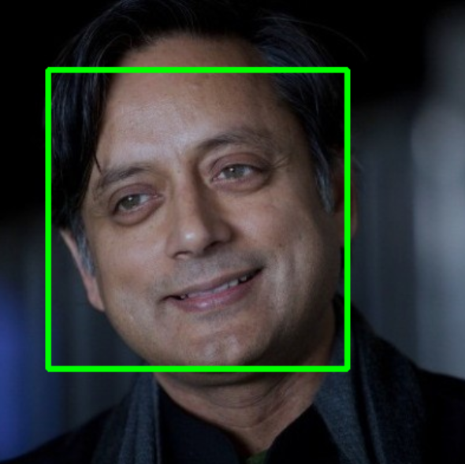
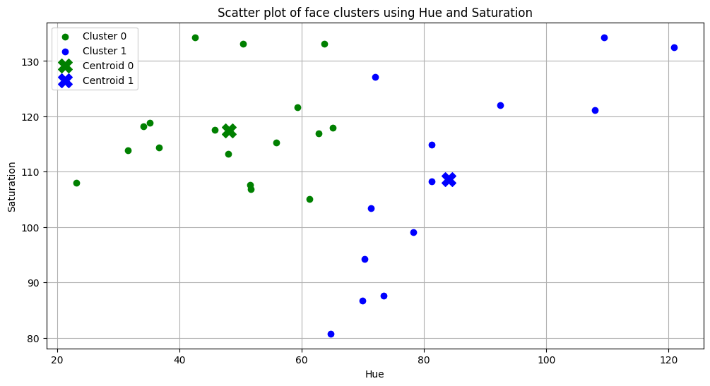
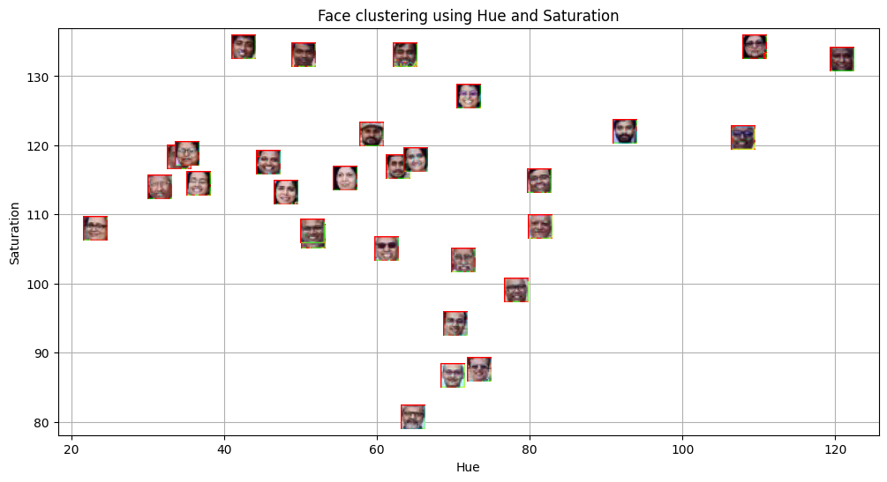
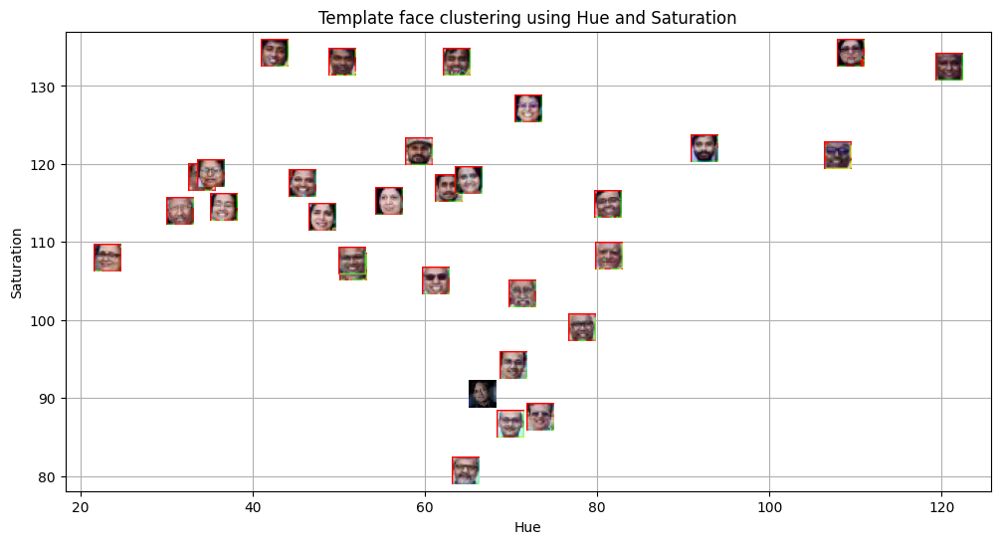
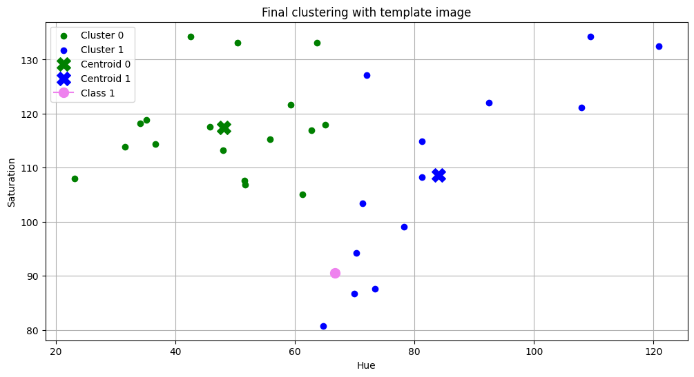

# Lab 5: Face Clustering using Hue and Saturation

## Aim
The aim of this lab is to detect faces from a group image, extract color-based features from the detected faces, and cluster the faces using a distance-based clustering algorithm. The lab also aims to classify a given template face image into one of the formed clusters.

---

## Methodology
First, the group image is read and converted to grayscale. A Haar Cascade classifier is used to detect faces in the image, and bounding boxes are drawn around the detected faces.

Next, the image is converted from BGR to HSV color space. From each detected face, the mean hue and saturation values are extracted. These values are used as feature vectors.

K-Means clustering with two clusters is applied on the hue and saturation features. The clustered faces are visualized using scatter plots and image markers, and centroids of each cluster are calculated.

A template image is then processed in the same way. Its hue and saturation features are extracted and passed to the trained K-Means model to predict its cluster label. The template image is finally visualized along with the clustered faces.

---

## Visuals

### Face Detection on Group Image

### Face Detection on Template Image

### Scatter Plot of Face Clusters

### Face Clustering using Image Markers

### Template Face Clustering

### Final Clustering with Template Image

---

## Result
Faces from the group image are successfully detected and clustered into two groups using hue and saturation values. The template image is correctly assigned to one of the clusters using the trained K-Means model. This demonstrates that simple color-based features can be used for basic face clustering and classification tasks.

---

## Tools and Libraries Used
- Python  
- OpenCV  
- NumPy  
- Matplotlib  
- Scikit-learn  

---

## Conclusion
This lab demonstrates a simple approach to face clustering using color-based features. Hue and saturation values provide an effective way to group faces. The template image was successfully classified into one of the clusters, showing the usefulness of distance-based clustering for basic face analysis tasks.
